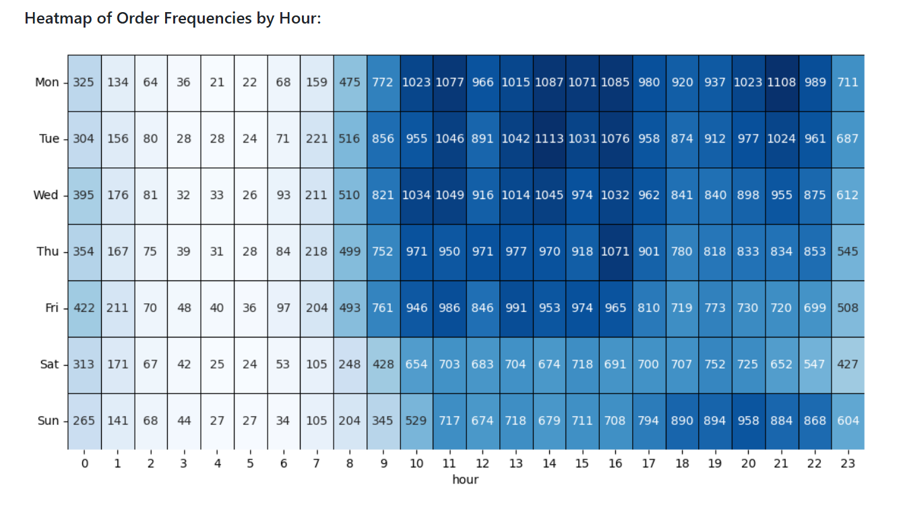

# Work Experience: 
---
Research Assistant, Economics Department @ Dickinson College, Carlisle, PA (*January 2025 - Present*)

Business Intelligence Intern @ KPIM, Hanoi, Vietnam (*May 2024 - August 2024*)

Math Tutor @ Marathon Education (*May 2023 - August 2023*)

# Portfolio
---
### E-Commerce Analysis | Python (Pandas, Numpy, Matplotlib, Seaborn).

  

Olist is an e-commerce platform in Brazil that connects merchants and their products to the country's main marketplaces. It offers merchants a seamless experience, enabling them to sell their products through the Olist Store and ship directly to customers using Olist's logistics partners.

The dataset used in this project includes information from 100,000 orders made between 2016 and 2018 in multiple marketplaces across Brazil. The dataset's features provide a multi-dimensional view of orders, covering aspects such as order status, price, payment, freight performance, customer location, product attributes, and customer reviews. Additionally, a geo-location dataset mapping Brazilian zip codes to latitude/longitude coordinates is available.

In this project, I use Python to load, clean, and analyze the data to propose three key strategies for Olist's revenue growth this year:

- **Business Opportunity 1**: Increase Customers and Retain Existing Customers.
- **Business Opportunity 2**: Boost Order Frequency – Peak order periods and RFM customer segmentation.
- **Business Opportunity 3**: Enhance Order Size – Analyze average order size and identify products frequently bought together. 

 

 

---
### Human Resource Management Analysis | Power BI (Power Query, Power Pivot, DAX formulas), Excel.

  

For this project, I utilized **Excel**, **Power Query**, and **Power Pivot** to extract, clean, and filter data from the database, ensuring the creation of accurate data that provided valuable insights for assessing Human Resource Management.

In the report, I utilized Power BI and developed advanced DAX formulas to track key metrics for Human Resource Management at KPIM such as the current number of employees, new hires, promotions, resignations, and the company's turnover rate. 

Additionally, the report enabled the evaluation of HR trends over time (monthly, quarterly, yearly), as well as by geographic location, job position, and department. This provided comprehensive HR insights to company leaders and the HR department, helping them:  

1. Assess the effectiveness of HR management.  
2. Make strategic decisions.
3. Improve human resource management more effectively. 

 

 

---
### Sales Analysis | PostgreSQL

This is my personal project utilizing SQL to clean and process a sales database, detecting outliers and improving data accuracy.

In this project, I employed advanced SQL techniques such as subqueries, CTEs, JOIN, and Window Functions to conduct in-depth analysis of key metrics and R-F-M Analysis to identify sale trends. 

 

 

